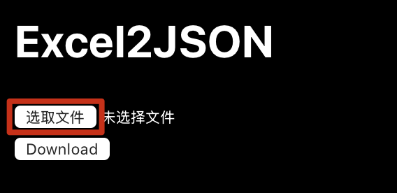
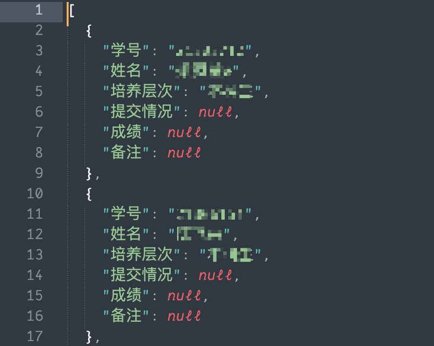
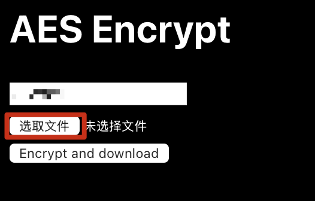
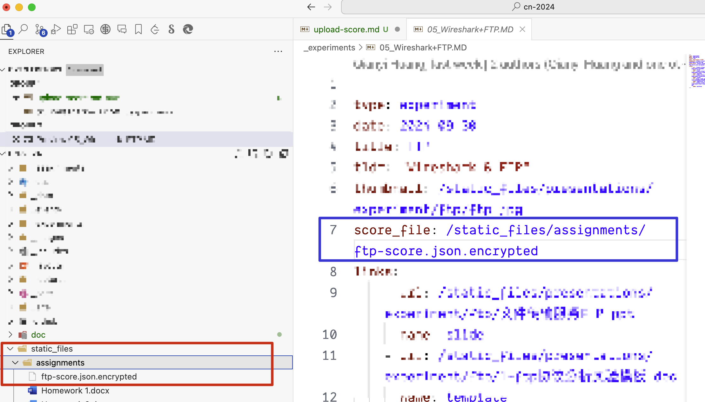

## 上传成绩

### 调整Excel文件
准备好成绩的Excel文件，Excel的表头每一项都是原子项(不允许有子表项)，查找的时候会匹配`学号`项的值，表头至少包含`学号`
正确的例子如下:

错误的例子如下:

上面的错误例子里面，第一个项下面还有3个子表项，不满足原子项的要求，这会导致excel转换json后无法正确匹配学号。

### 转换为json文件
打开转换网站[Excel2Json](https://powertoy.ourfor.top)，这个网站是静态网站完全在浏览器运行，不会将文件上传，转换和加密都在浏览器上进行，

选择Excel文件，点击上传，然后点击下载json文件，将下载的json文件保存到本地。

检查下载的json文件，这个json最外面是一个数组，里面每一项都是一个字典，字典的key是表头的项，value是对应的值，如下:
```json
[
    {
        "学号": "********",
        "姓名": "******",
        ...
    },
    {
        "学号": "********",
        "姓名": "******",
        ...
    }
]
```



### 加密json文件
将json文件通过AES进行对称加密，密码默认已经填好，选择下载的json文件，点击加密，将加密后的文件保存到本地。


### 上传成绩
将加密后的json文件放在`/static_files/assignments/`目录下，然后在对应的实验文件中添加`score_file`字段，指向加密后的json文件。


只要存在`score_file`字段，页面就会显示成绩查询按钮，输入学号就可以查询对应的成绩。